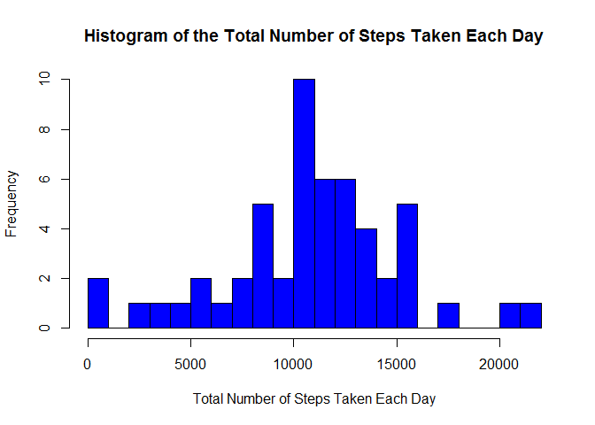
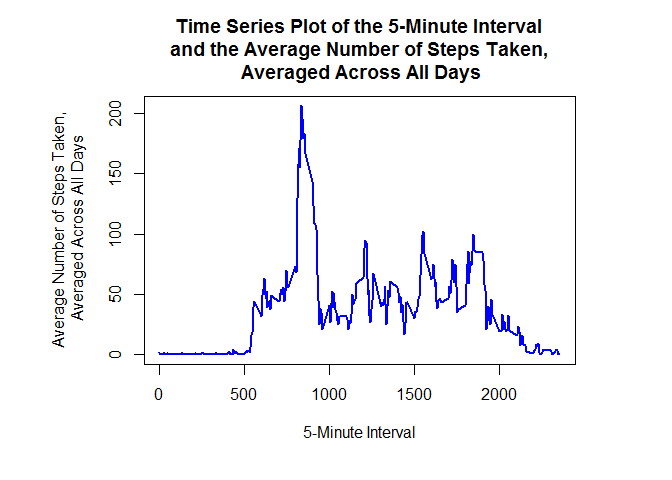
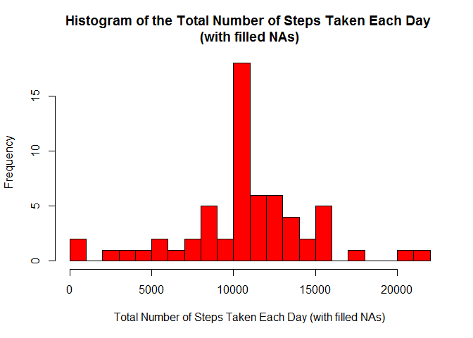
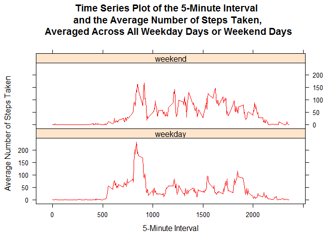

# Reproducible Research: Peer Assessment 1


## Loading and preprocessing the data
##### 1. Load the data (i.e. read.csv())

```r
if(!file.exists('activity.csv')){
    unzip(zipfile="activity.zip")
}
activity <- read.csv("activity.csv", header = TRUE, sep = ',', colClasses=c("numeric","character","integer"))
```
##### 2. Process/transform the data (if necessary) into a format suitable for your analysis

```r
# Here I subset the data without missing values (na) for later use
without_na <- activity[complete.cases(activity),]
```
-----

## What is mean total number of steps taken per day?

For this part of the assignment, you can ignore the missing values in the dataset.

#####  1. Make a histogram of the total number of steps taken each day

```r
# Compute the total number of steps taken per day
total <- aggregate(steps ~ date, without_na, sum)
# I add descriptive variable names
names(total)[2] <- "sum_steps"

# Plot the histogram, using breaks for better visuals.
hist(
    total$sum_steps,
    col = "blue",
    main = "Histogram of the Total Number of Steps Taken Each Day",
    xlab = "Total Number of Steps Taken Each Day",
    breaks = 20
)
```



##### 2. Calculate and report the mean and median total number of steps taken per day

```r
# Compute the Mean
mean(total$sum_steps)
```

```
## [1] 10766.19
```

```r
# Compute the Median
median(total$sum_steps)
```

```
## [1] 10765
```

## What is the average daily activity pattern?

##### 1. Make a time series plot (i.e. type = "l") of the 5-minute interval (x-axis) and the average number of steps taken, averaged across all days (y-axis)


```r
## Compute the average number of steps taken, averaged across all days for each 5-minute interval
interval <- aggregate(steps ~ interval, without_na, mean)

## Add descriptive variable names
names(interval)[2] <- "mean_steps"

## Format the plot margins to accommodate long text labels.
par(mai = c(1.2,1.5,1,1))

## Plot the time series
plot(
    x = interval$interval,
    y = interval$mean_steps,
    type = "l",
    main = "Time Series Plot of the 5-Minute Interval\n and the Average Number of Steps Taken, \n Averaged Across All Days",
    xlab = "5-Minute Interval",
    ylab = "Average Number of Steps Taken,\n Averaged Across All Days",
    col="blue", 
    lwd=2
)
```



##### 2. Which 5-minute interval, on average across all the days in the dataset, contains the maximum number of steps?


```r
interval[which.max(interval$mean_steps),]
```

```
##     interval mean_steps
## 104      835   206.1698
```

## Imputing missing values

##### 1. Calculate and report the total number of missing values in the dataset (i.e. the total number of rows with NAs)


```r
nrow(activity[is.na(activity$steps),])
```

```
## [1] 2304
```

##### 2. Devise a strategy for filling in all of the missing values in the dataset. The strategy does not need to be sophisticated. For example, you could use the mean/median for that day, or the mean for that 5-minute interval, etc.

```r
# I will use the mean for the 5-minute interval to fill NA values for a given internval.
```

##### 3. Create a new dataset that is equal to the original dataset but with the missing data filled in.


```r
# Merge original activity data frame with interval data frame
newactivity <- merge(activity, interval, by = 'interval', all.y = F)

# Merge NA values with averages rounding up for integers
newactivity$steps[is.na(newactivity$steps)] <- as.integer(round(newactivity$mean_steps[is.na(newactivity$steps)]))

# Keep the columns of the original activity data frame
newactivity <- newactivity[names(activity)]
```

##### 4. Make a histogram of the total number of steps taken each day and Calculate and report the mean and median total number of steps taken per day.


```r
# Total number of steps taken per day with NAs filled
newtotal <- aggregate(steps ~ date, newactivity, sum)
# Add descriptive variable names
names(newtotal)[2] <- "sum_steps"

hist(
    newtotal$sum_steps,
    col="red",
    main = "Histogram of the Total Number of Steps Taken Each Day \n(with filled NAs)",
    xlab = "Total Number of Steps Taken Each Day (with filled NAs)",
    breaks = 20,
)
```



```r
# Compute the mean
mean(newtotal$sum_steps)
```

```
## [1] 10765.64
```

```r
# Compute the median
median(newtotal$sum_steps)
```

```
## [1] 10762
```

Do these values differ from the estimates from the first part of the assignment?


```r
# They do differ, but the differences are quite small:

# mean(total) = 10766.19 vs mean(newtotal) = 10765.64. 
# If we use rounding, we have the  same value.

# A similar result holds for the median:
# median(total) = 10765 vs median(newtotal) = 10762. 
```

What is the impact of imputing missing data on the estimates of the total daily number of steps?


```r
# This depends on how you impute the missing data. Given that I used the average for a given interval, there was no substantial difference, because the averages got closer to the inserted average value.
```

## Are there differences in activity patterns between weekdays and weekends?

##### 1. Create a new factor variable in the dataset with two levels - "weekday" and "weekend" indicating whether a given date is a weekday or weekend day.


```r
# Create a new data frame
newnewactivity <- newactivity

# Set up logical/test vector
weekend <- weekdays(as.Date(newnewactivity$date)) %in% c("Saturday", "Sunday")

# Fill in weekday column
newnewactivity$daytype <- "weekday"

# Replace "weekday" with "weekend" where day == Sat/Sun
newnewactivity$daytype[weekend == TRUE] <- "weekend"

# Convert new character column to factor
newnewactivity$daytype <- as.factor(newnewactivity$daytype)

# Check out the structure of the new data frame
str(newnewactivity)
```

```
## 'data.frame':	17568 obs. of  4 variables:
##  $ steps   : num  2 0 0 0 0 0 0 0 0 0 ...
##  $ date    : chr  "2012-10-01" "2012-11-23" "2012-10-28" "2012-11-06" ...
##  $ interval: int  0 0 0 0 0 0 0 0 0 0 ...
##  $ daytype : Factor w/ 2 levels "weekday","weekend": 1 1 2 1 2 1 2 1 1 2 ...
```

##### 2. Make a panel plot containing a time series plot (i.e. type = "l") of the 5-minute interval (x-axis) and the average number of steps taken, averaged across all weekday days or weekend days (y-axis).


```r
# The average number of steps taken, averaged across all days for each 5-minute interval
newinterval <- aggregate(steps ~ interval + daytype, newnewactivity, mean)

# Add descriptive variable names
names(newinterval)[3] <- "mean_steps"

# Plot the time series
library(lattice)
xyplot(
    mean_steps ~ interval | daytype,
    newinterval,
    type = "l",
    layout = c(1,2),
    main = "Time Series Plot of the 5-Minute Interval \n and the Average Number of Steps Taken, \n Averaged Across All Weekday Days or Weekend Days",
    lty=1,
    col="red",
    xlab = "5-Minute Interval",
    ylab = "Average Number of Steps Taken"
)
```



P.S. The figures are placed in the `PA1_template_files/figure-html` directory created by default by R-studio Version 0.99.491. See the PA1_template.md file to see them embedded in the text.
